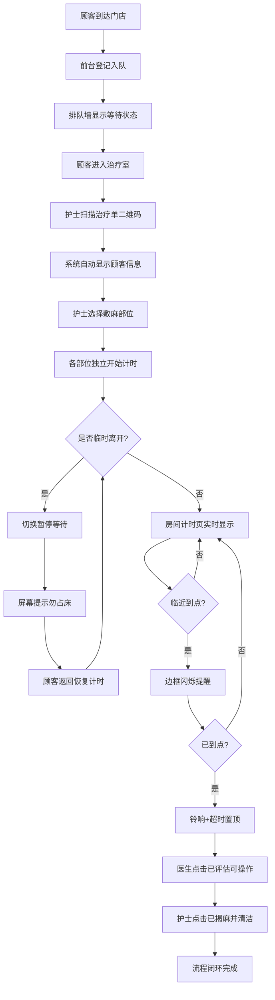

## 1. 产品概述

麻药敷贴计时器——专为高客流轻医美门店治疗室门口平板设计的一站式敷麻流程管理工具。通过扫码开麻、多部位独立计时、大色块状态可视化和闭环确认，让医生、护士、咨询师一目了然地掌握每位顾客的敷麻进度，避免超时遗漏和床位浪费。

- **解决痛点**：传统敷麻靠人工计时、口头提醒，高客流时极易遗漏超时或占床等待，影响顾客体验和运营效率
- **目标用户**：轻医美门店的医生、护士、咨询师和前台管理人员
- **核心价值**：降低敷麻超时风险、提升治疗床周转率、保护顾客隐私、适配无人值守场景

## 2. 核心功能

### 2.1 用户角色

| 角色 | 登录方式 | 核心权限 |
|------|----------|----------|
| 护士 | 扫码/选择身份 | 扫码开麻、揭麻确认、暂停/恢复计时 |
| 医生 | 扫码/选择身份 | 评估确认（已评估可操作） |
| 咨询师 | 扫码/选择身份 | 查看排队墙、查看房间状态 |
| 管理员 | 密码 | 门店设置、数据查看 |

### 2.2 功能模块

1. **顾客排队墙**：显示所有等待敷麻和正在敷麻的顾客列表，按状态和紧急程度排序
2. **房间计时**：大色块展示各房间敷麻状态，支持多部位独立计时、临近闪烁、超时置顶
3. **扫码开麻**：扫描治疗单二维码，自动填充顾客信息，按部位分别开始计时
4. **完成确认**：医生评估 + 护士揭麻形成完整闭环，含暂停等待功能
5. **门店设置**：铃声音量、隐私保护、夜间静音、默认项目时长配置

### 2.3 页面详情

| 页面名称 | 模块名称 | 功能描述 |
|----------|----------|----------|
| 顾客排队墙 | 状态筛选栏 | 按全部/等待中/敷麻中/已完成筛选顾客 |
| 顾客排队墙 | 顾客卡片列表 | 显示顾客昵称、项目、部位、状态标签、等待时长 |
| 顾客排队墙 | 快速操作 | 点击顾客卡片跳转至对应房间计时详情 |
| 房间计时 | 房间状态色块 | 绿色=敷麻中、黄色=临近到点(最后5分钟)、红色=已超时、灰色=空闲 |
| 房间计时 | 部位独立计时 | 每个部位单独显示倒计时、开始时间和预计揭麻时间 |
| 房间计时 | 闪烁边框 | 临近到点时屏幕边框黄色闪烁提醒 |
| 房间计时 | 超时置顶 | 超时房间自动排到最上方并持续红色边框 |
| 扫码开麻 | 二维码扫描区 | 调用摄像头扫描治疗单二维码 |
| 扫码开麻 | 顾客信息确认 | 自动显示顾客昵称、项目、部位，支持手动编辑 |
| 扫码开麻 | 部位选择 | 多选额头、下颌、唇周等部位，各自独立开始计时 |
| 扫码开麻 | 开始计时按钮 | 确认后各部位独立开始倒计时 |
| 完成确认 | 医生评估 | "已评估可操作"按钮，确认顾客可以进入治疗 |
| 完成确认 | 护士揭麻 | "已揭麻并清洁"按钮，确认揭麻完成 |
| 完成确认 | 暂停等待 | 顾客临时离开时切换为暂停等待，提示不要继续占用治疗床 |
| 完成确认 | 操作日志 | 记录每步操作的时间戳和操作人 |
| 门店设置 | 铃声音量 | 滑块调节提醒铃声音量(0-100) |
| 门店设置 | 隐私保护 | 开关控制是否隐藏顾客全名，仅显示昵称/姓氏 |
| 门店设置 | 夜间静音 | 设置静音时段（开始时间-结束时间），静音期间仅闪烁不响铃 |
| 门店设置 | 默认项目时长 | 配置各项目/部位的默认敷麻时长（分钟） |

## 3. 核心流程

顾客到达门店 → 前台登记入队 → 排队墙显示等待状态 → 顾客进入治疗室 → 护士扫描治疗单二维码 → 系统自动显示顾客信息 → 护士选择敷麻部位 → 各部位独立开始计时 → 房间计时页实时显示状态 → 临近到点边框闪烁 → 到点铃响提醒 → 医生进入点击"已评估可操作" → 护士点击"已揭麻并清洁" → 流程闭环完成

若顾客临时离开：点击"暂停等待" → 计时暂停 → 屏幕提示不要继续占用治疗床 → 顾客返回后恢复计时

## 4. 用户界面设计

### 4.1 设计风格

- **主色调**：深炭灰(#1A1A2E)为底，搭配薄荷绿(#00D4AA)作为活力主色、珊瑚橙(#FF6B6B)作为警告/超时色
- **次色调**：淡金(#FFD93D)作为临近提醒色、冰蓝(#4ECDC4)作为信息辅助色
- **按钮风格**：圆角大按钮(12px圆角)，扁平化设计，高对比度文字
- **字体**：标题使用 DIN Alternate 风格数字字体（计时器核心），正文使用 Noto Sans SC
- **布局风格**：底部导航栏切换5个窗口，内容区大色块卡片布局
- **图标风格**：线性图标(Lucide)，2px描边，搭配色块背景使用
- **整体调性**：医疗级专业感 + 科技感，暗色主题减少平板屏幕眩光，适合走廊/门口环境

### 4.2 页面设计概览

| 页面名称 | 模块名称 | UI元素 |
|----------|----------|--------|
| 顾客排队墙 | 状态筛选栏 | 顶部水平Tab切换，选中态带下划线高亮，薄荷绿强调色 |
| 顾客排队墙 | 顾客卡片 | 左侧色条标识状态，内部显示昵称/项目/部位标签，右侧倒计时数字 |
| 房间计时 | 房间色块 | 大尺寸圆角卡片，背景色随状态变化，中心超大倒计时数字 |
| 房间计时 | 部位计时条 | 房间卡片内横向排列，每部位独立进度条+倒计时 |
| 房间计时 | 闪烁边框 | CSS动画：2px边框从透明到黄色脉冲闪烁，1.5s周期 |
| 扫码开麻 | 扫描框 | 中心方形取景框，四角装饰性L型边角，薄荷绿描边 |
| 扫码开麻 | 部位选择 | 多选标签按钮组，选中态填充薄荷绿 |
| 完成确认 | 操作按钮 | 全宽大按钮，医生操作薄荷绿、护士操作冰蓝、暂停珊瑚橙 |
| 完成确认 | 操作日志 | 底部时间轴列表，圆点+连接线样式 |
| 门店设置 | 设置项 | 列表式布局，右侧操作控件（滑块/开关/输入框） |

### 4.3 响应式设计

- **桌面优先**：主要适配 10-12寸平板横屏(1280x800)场景
- **触控优化**：所有可点击区域最小 44x44px，按钮间距 ≥ 12px
- **大字体**：计时数字使用 48px+ 字号，确保 2 米外可辨识
- **横屏锁定**：界面设计假定横屏使用

### 4.4 无3D场景需求

本项目为功能性工具应用，无需3D场景。
