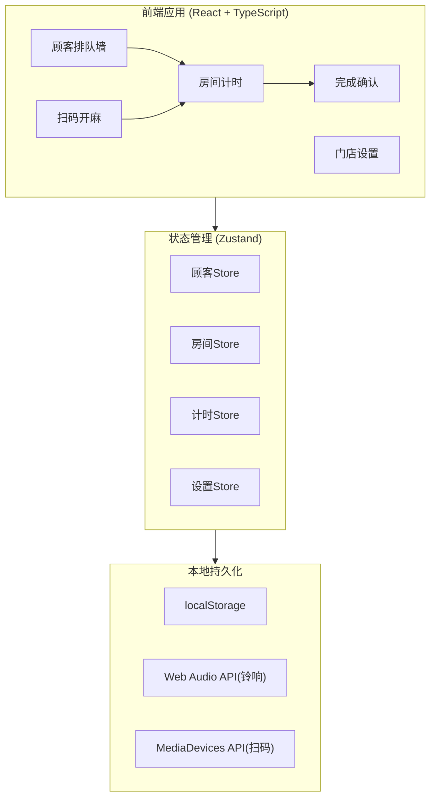
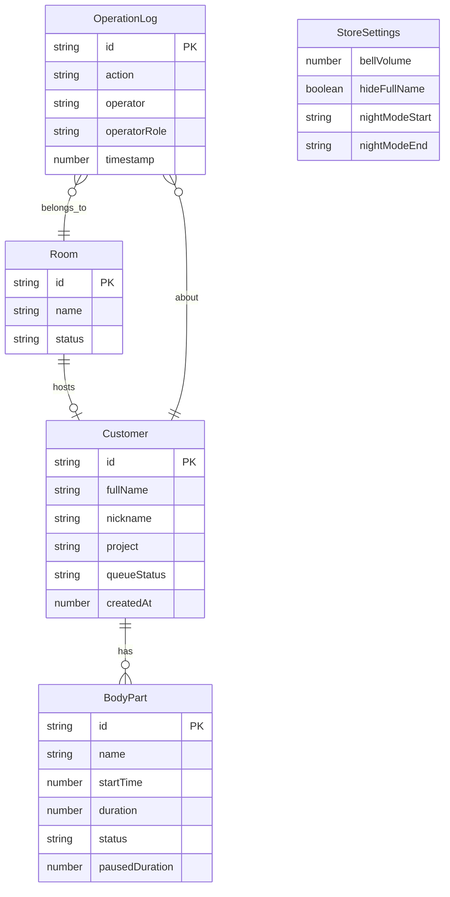

## 1. 架构设计



本项目为纯前端应用，无需后端服务。所有数据通过 Zustand 状态管理 + localStorage 持久化，扫码功能使用浏览器原生 MediaDevices API，铃响使用 Web Audio API。

## 2. 技术说明

- **前端**：React@18 + TypeScript + Tailwind CSS@3 + Vite
- **初始化工具**：vite-init (react-ts 模板)
- **状态管理**：Zustand（轻量级、无 boilerplate）
- **路由**：react-router-dom@6
- **图标**：lucide-react
- **后端**：无（纯前端应用，数据存 localStorage）
- **数据库**：无（使用 localStorage + 内存状态模拟）

## 3. 路由定义

| 路由 | 用途 |
|------|------|
| / | 顾客排队墙，默认首页 |
| /rooms | 房间计时页面，显示所有房间敷麻状态 |
| /scan | 扫码开麻页面，扫描治疗单二维码 |
| /confirm/:roomId | 完成确认页面，医生评估+护士揭麻闭环 |
| /settings | 门店设置页面，铃声音量/隐私/静音/时长配置 |

## 4. API 定义

无后端 API。数据流通过 Zustand Store 在前端内部流转。

### 4.1 核心 TypeScript 类型

```typescript
type TimerStatus = 'waiting' | 'active' | 'pausing' | 'nearing' | 'overdue' | 'completed'

interface BodyPart {
  id: string
  name: string
  startTime: number
  duration: number
  status: TimerStatus
  pausedAt?: number
  pausedDuration: number
}

interface Customer {
  id: string
  fullName: string
  nickname: string
  project: string
  bodyParts: BodyPart[]
  roomId: string
  queueStatus: 'waiting' | 'in_room' | 'completed'
  createdAt: number
}

interface Room {
  id: string
  name: string
  customerId?: string
  status: 'idle' | 'active' | 'nearing' | 'overdue' | 'pausing' | 'completed'
}

interface OperationLog {
  id: string
  roomId: string
  customerId: string
  action: 'start' | 'evaluate' | 'remove' | 'pause' | 'resume' | 'complete'
  operator: string
  operatorRole: 'doctor' | 'nurse'
  timestamp: number
}

interface StoreSettings {
  bellVolume: number
  hideFullName: boolean
  nightModeStart: string
  nightModeEnd: string
  defaultDurations: Record<string, number>
}
```

## 5. 无服务端架构

本项目不涉及服务端。

## 6. 数据模型

### 6.1 数据模型定义



### 6.2 初始化数据

应用启动时注入 6 间模拟房间和 3-5 条模拟顾客数据，便于演示和测试。房间命名：治疗1室~治疗6室。默认敷麻时长配置：额头30分钟、下颌25分钟、唇周20分钟、面颊25分钟、颈部30分钟。
